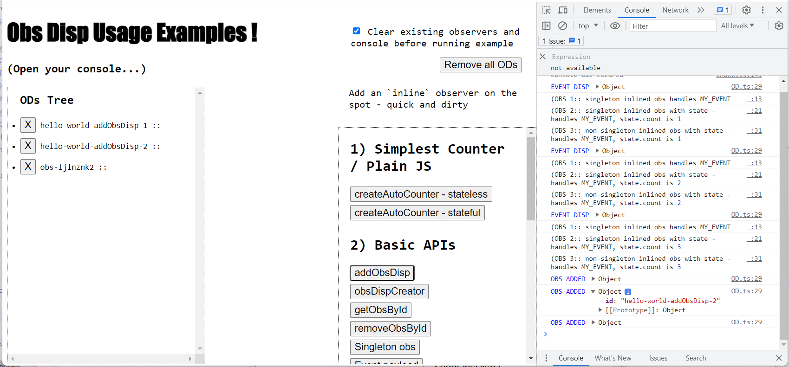

# obs-disp-examples
obs-disp usage examples to get you started

## What's obs-disp?

[`obs-disp`](https://github.com/AweSkyBear/obs-disp) is a thin wrapper for writing straight-to-the-point JavaScript.

It's so thin, that it makes use of just functions and objects, allowing you to build complete and scalable apps, running in the browser!

Want to know more? [Check its README](https://github.com/AweSkyBear/obs-disp)!

## Live page /

**TODO** The examples page is available here

## Running locally

`npm install`

`npm start`

Open `http://localhost:9003`

## What should I expect?

Hey, glad you're reading this! Thank you in advance for taking a look!

The current repo (examples) are minimal in terms of CSS, it's all pure JavaScript. That's on purpose.
I am focusing on what obs-disp does and how it can be used.

### Some considerations

- consider `Basic APIs` section an introduction to the most important APIs that you would use when building apps, games or experiments with `obs-disp.
- consider the `Counter - Full Power` section more of a tutorial on building some piece of dynamic UI with `obs-disp`
- you can expect more examples to be added over time / or you could submit some yourself, via opening a PR : )

